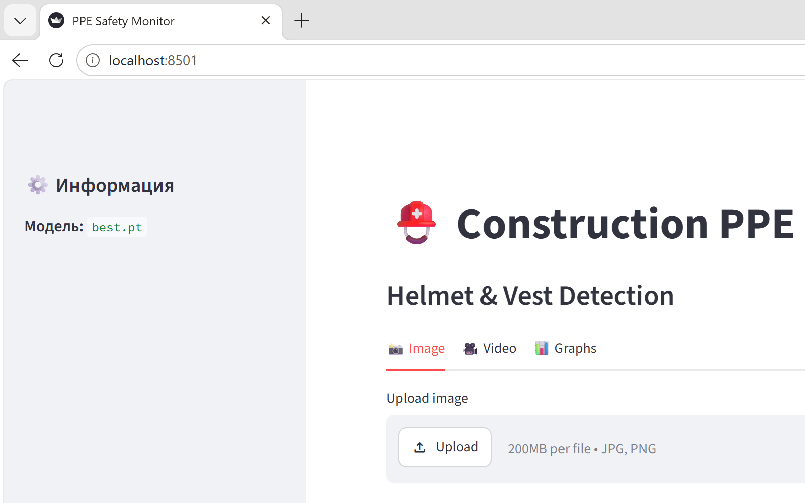
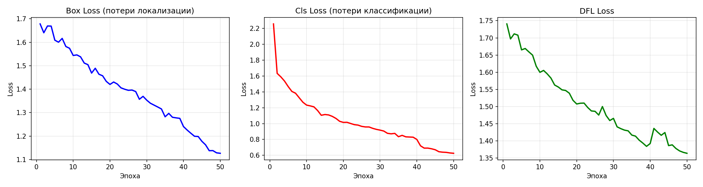
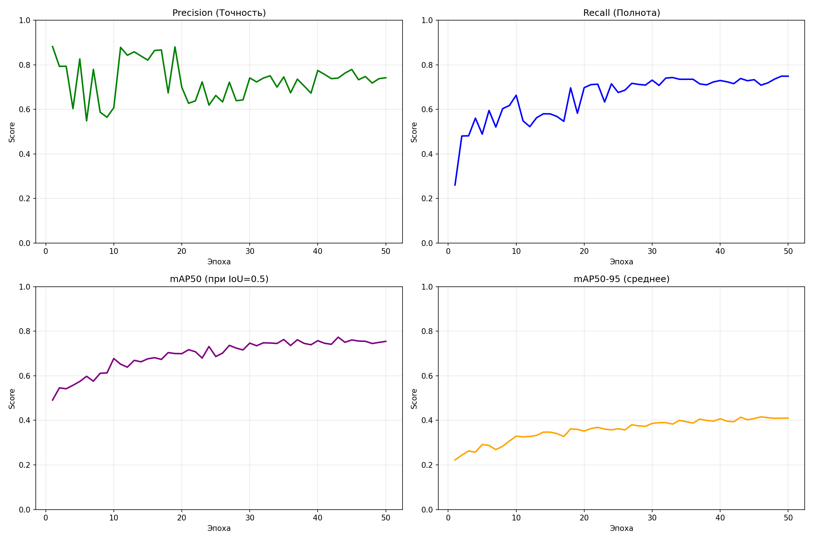
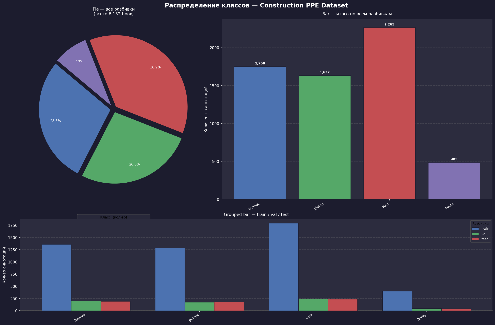
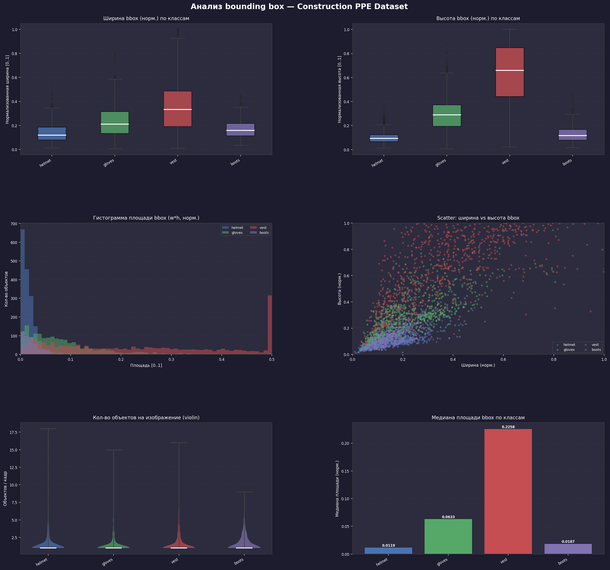
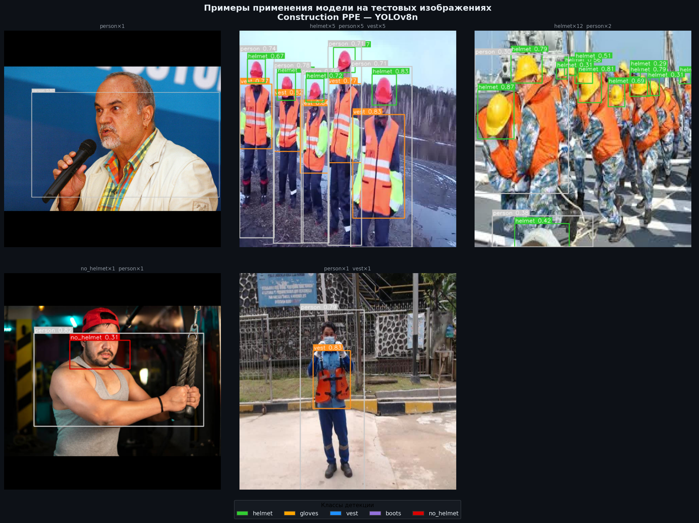
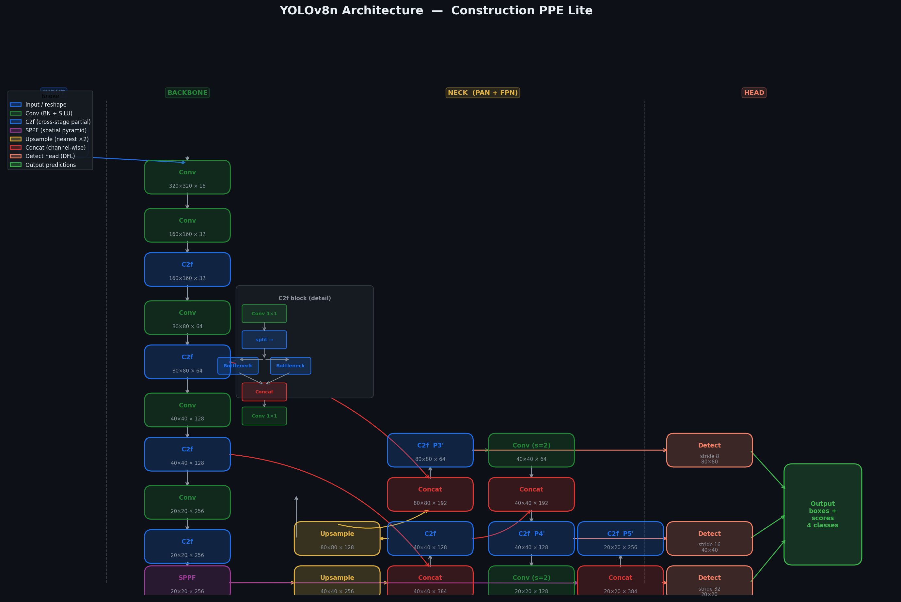

# YOLOv8 Vest Detection 

> A computer-vision system that automatically detects high-visibility safety
> vests on workers — an end-to-end pipeline from raw images to a trained YOLOv8
> model and an interactive web demo.


## Overview

Personal-protective-equipment (PPE) compliance on construction sites is usually
checked by hand. This project automates one part of it — detecting whether
workers are wearing a safety vest — by training a **YOLOv8n** object-detection
model on a construction-PPE dataset and serving it through a Streamlit web app.

- **Dataset:** 1413 labelled images (`datasets/construction-ppe`)
- **Model:** YOLOv8n (nano) — lightweight, fast, deployable on CPU
- **Result:** **mAP@50 = 0.732**
- **Demo:** interactive Streamlit app (upload an image → get detections)



## Results

| Metric | Value |
|--------|-------|
| mAP@50 | **0.732** |
| Model  | YOLOv8n |
| Training images | 1413 |

Training and evaluation visuals (generated by the scripts below):

| Training losses | Metrics |
|---|---|
|  |  |

| Class distribution | Bounding-box analysis |
|---|---|
|  |  |

Example inferences and the model architecture:





## Pipeline

The project is organised as a numbered, reproducible pipeline — run the scripts
in order:

| Step | Script | What it does |
|------|--------|--------------|
| 1 | `1_prepare_dataset.py` | Prepare and split the construction-PPE dataset into YOLO format |
| 2 | `2_train_model.py` | Train YOLOv8n on the prepared data |
| 3 | `3_plot_metrics.py` | Plot training curves and evaluation metrics |
| 4 | `4_demo_app.py` | Streamlit web demo for live inference |
| 5 | `5_generate_visuals.py` | Render the result figures used in this README |
| 6 | `6_class_distribution.py` | Analyse class balance in the dataset |
| 7 | `7_bbox_analysis.py` | Analyse bounding-box sizes and positions |
| 8 | `8_yolo_architecture.py` | Draw the YOLOv8 architecture diagram |
| 9 | `9_inference_examples.py` | Run and visualise example detections |

## Repository structure

```
YOLOv8-vest-detection/
├── datasets/construction-ppe/   # images + YOLO-format labels
├── runs/detect/.../ppe_lite/    # training run outputs
├── utils/                       # helper functions
├── 1_prepare_dataset.py … 9_inference_examples.py
├── config.yaml                  # dataset / training configuration
├── training_metrics.csv         # per-epoch metrics log
├── yolov8n.pt                   # trained weights
├── requirements.txt
└── *.png                        # result figures
```

## Quick start

```bash
git clone https://github.com/t4rantul777/YOLOv8-vest-detection.git
cd YOLOv8-vest-detection
pip install -r requirements.txt

# reproduce the pipeline
python 1_prepare_dataset.py
python 2_train_model.py

# or just launch the web demo with the trained weights
streamlit run 4_demo_app.py
```

## Tech stack

`Python` · `PyTorch` · `Ultralytics YOLOv8` · `Streamlit` · `pandas` · `Matplotlib`

## What I practised

- Building a **reproducible ML pipeline** (data prep → training → evaluation → demo)
- Training and evaluating an **object-detection** model (YOLOv8n), reading mAP / loss curves
- **Exploratory analysis** of a labelled dataset (class balance, bounding-box statistics)
- Shipping a model behind an **interactive Streamlit interface**

---

<details>
<summary>🇷🇺 Кратко на русском</summary>

<br>

Система компьютерного зрения для автоматического распознавания сигнальных
жилетов на рабочих. Полный пайплайн: подготовка данных → обучение **YOLOv8n**
на 1413 изображениях → оценка (**mAP@50 = 0.732**) → веб-демо на Streamlit.
Скрипты пронумерованы по шагам (`1_prepare_dataset.py` … `9_inference_examples.py`),
результаты и графики — в PNG. Запуск демо: `streamlit run 4_demo_app.py`.

</details>
